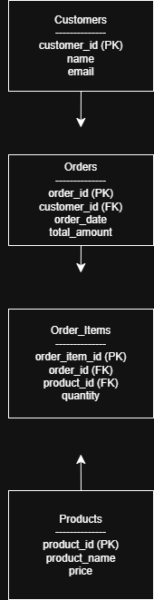

🛒 E-commerce Sales Data Analysis using SQL

-----

---
📌 Project Overview

Analyzed 10K+ e-commerce sales records using SQL to identify revenue trends, top-performing products, and customer behavior for data-driven decision making.
---
❗ Problem Statement

• Difficulty in identifying high-revenue products  
• Limited visibility into customer purchasing behavior  
• Challenges in detecting underperforming products  
---
💡 Solution

Performed data analysis using SQL queries including joins, aggregations, and filtering to extract meaningful business insights.
---
🛠️ Tech Stack

• SQL  
• Relational Database Design  
• ER Modeling  
---
📊 Key Analysis

• Identified top-selling products  
• Calculated revenue per product  
• Analyzed customer purchase behavior  
• Found highest spending customers  
• Detected products with no sales  
---
📈 Results & Impact

• Analyzed 10K+ sales records to identify key trends  
• Identified top revenue-generating products  
• Discovered high-value customers  
• Highlighted underperforming products  
---
🗂️ Project Structure

• schema/ → Database creation scripts  
• data/ → Sample data  
• queries/ → Basic SQL queries  
• advanced_queries/ → Business insights  
---
🗄️ Database Schema Explanation

The database consists of four main tables:

• Customers – customer details  
• Orders – order information  
• Order_Items – product mapping with orders  
• Products – product details  
---
🔗 Relationships

• One customer → multiple orders (1:N)  
• One order → multiple items (1:N)  
• Each item → one product (N:1)  
---
🔍 Sample Query Output

📌 Customers Data 

📌 Products Data  

📌 Top Revenue Products 

---
🎯 Project Purpose

Demonstrates how SQL can be used to analyze structured data and generate business insights.
---
🚀 Future Improvements

• Integrate with Power BI  
• Use real-world datasets  
• Automate reporting  
---
👨‍💻 Created By

Dudekula Reshma

