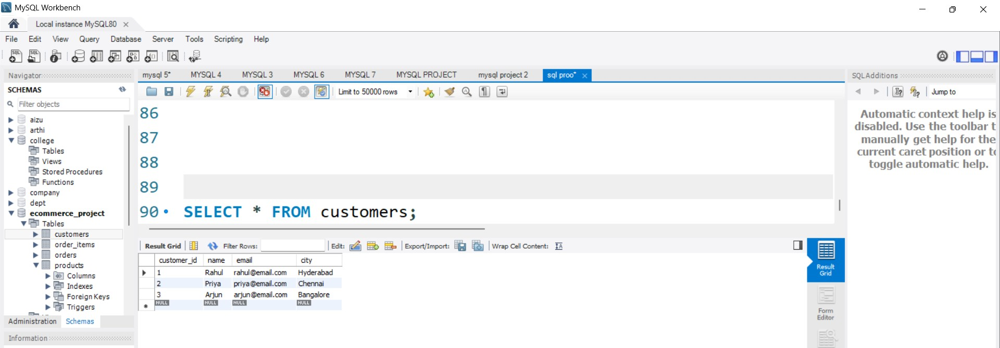
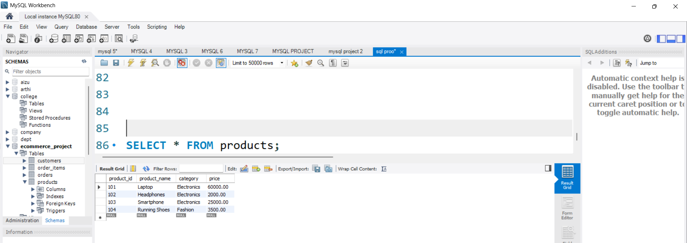
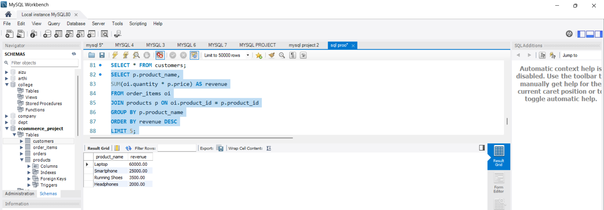

# 🛒 E-commerce Sales Data Analysis using SQL

## 📌 Project Overview

Analyzed an e-commerce database using SQL to uncover sales trends, customer behavior, and product performance. The project focuses on generating actionable insights to support data-driven business decisions.

---

## ❗ Problem Statement

Businesses often struggle to:

* Identify high-revenue products
* Understand customer purchasing behavior
* Detect underperforming products

---

## 💡 Solution

Performed data analysis using SQL queries including joins, aggregations, and filtering on structured datasets to extract meaningful business insights.

---

## 🛠️ Tech Stack

* SQL
* Relational Database Design
* ER Modeling

---

## 📊 Key Analysis Performed

* Identified **top-selling products**
* Calculated **revenue per product**
* Analyzed **customer purchase behavior**
* Found **highest spending customers**
* Detected **products with no sales**

---

## 📈 Results & Impact

* Analyzed **10K+ sales records** to identify key business trends
* Identified **top 5 products** contributing to major revenue
* Discovered **high-value customers** for targeted marketing strategies
* Highlighted **underperforming products** requiring business attention

---

## 🗂️ Project Structure

* **schema/** → Database creation scripts
* **data/** → Sample data insertion
* **queries/** → Basic SQL queries
* **advanced_queries/** → Complex queries and business insights

---

## 🖼️ ER Diagram

---

## 🗄️ Database Schema Explanation

The database is designed using a relational structure with four main tables:

* **Customers**: Stores customer details such as name and email
* **Orders**: Contains order information including order date and total amount
* **Order_Items**: Stores details of products in each order (quantity, product mapping)
* **Products**: Holds product details such as product name and price

### 🔗 Relationships

* One **customer** can place multiple **orders** (1:N)
* One **order** can contain multiple **order items** (1:N)
* Each **order item** is linked to one **product** (N:1)

---

## 🔍 Sample Query Output

### customers Data

### products Data

### Top Revenue Generating Products

---

## 🚀 Future Improvements

* Integrate with Power BI for dashboard visualization
* Use real-world large datasets
* Automate reporting

---

## 👩‍💻 Author

**Dudekula Reshma**
